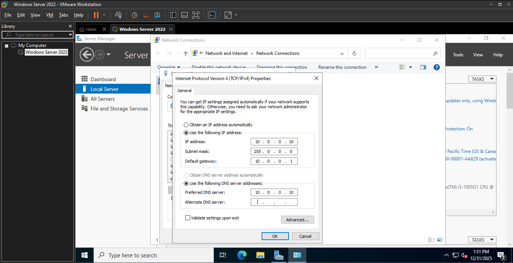
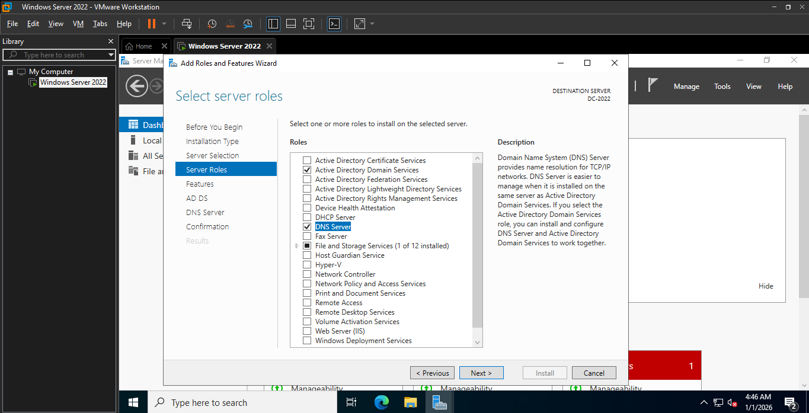
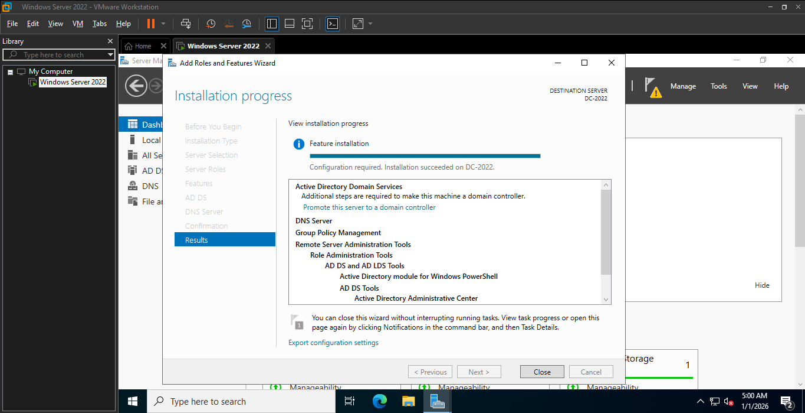
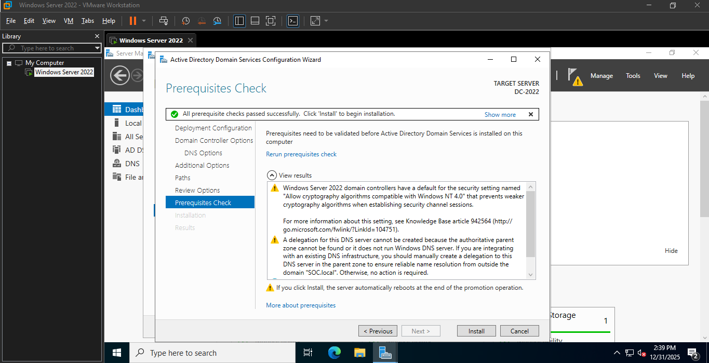
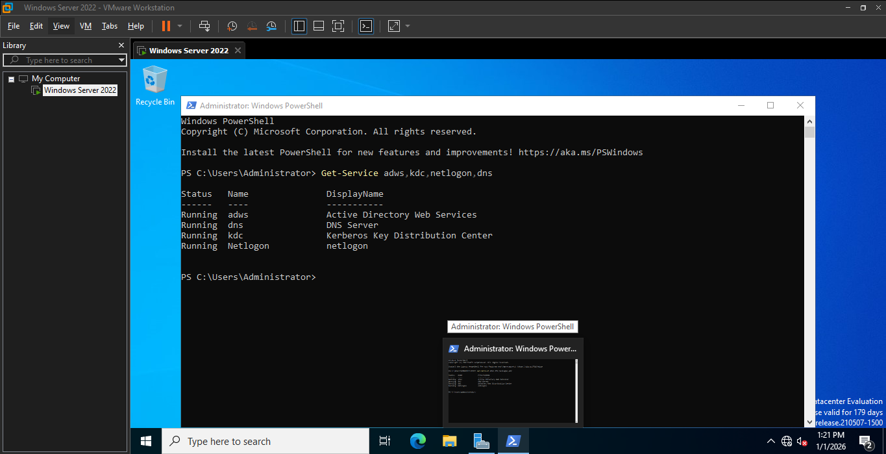
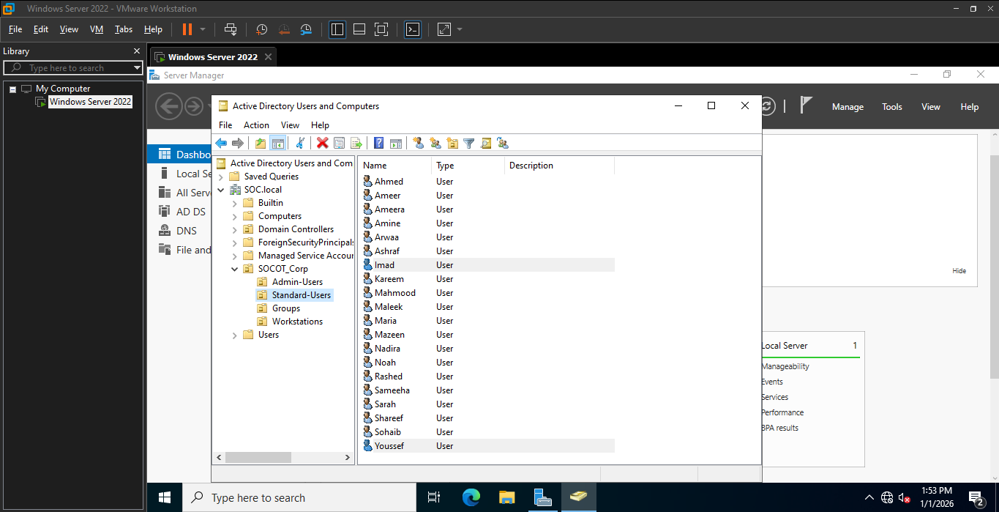
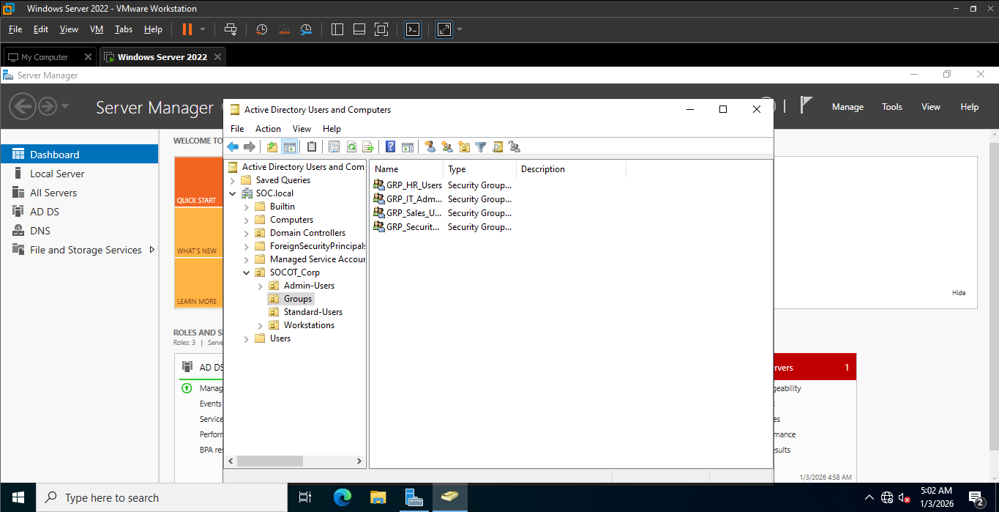
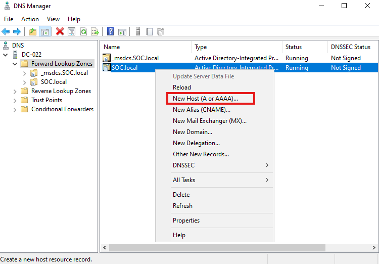

# Project 1: Secure Enterprise Infrastructure & SOC Lab Deployment

##  Overview
This project involves the end-to-end installation and configuration of **Windows Server 2022 Data Center** to serve as the primary Domain Controller (DC-022) for a secure hybrid enterprise environment.

##  System Specifications & Resources
| Feature | Details |
| :--- | :--- |
| **Operating System** | Windows Server 2022 Data Center |
| **Hostname** | DC-022 |
| **RAM** | 2 GB (Optimized for 20 users) |
| **CPU** | 2 Cores |
| **Storage** | 40 GB SATA |

---

##  Phase 1: Installation & Troubleshooting
During the initial setup in VMware Workstation, a critical issue was encountered that prevented the OS installation.

###  The Problem: "No Images Available"
Upon reaching the operating system selection screen, the installer displayed an error: **"No images are available"**. This was likely due to a conflict with the virtual hard disk controller type or the initial disk configuration.

> **Visual Evidence of Error:**
> 

###  The Solution: Disk Reconfiguration
To resolve this, I performed the following troubleshooting steps:
1. **Hard Disk Removal:** Deleted the existing virtual hard disk from the VM settings.
2. **Floppy Removal:** Removed the virtual Floppy drive and the associated autoinst.flp file from the VM settings.
3. **New Disk Creation:** Added a new Hard Disk via the **Add Hardware Wizard**.
4. **Controller Type:** Specifically selected **SATA** to ensure compatibility.
5. **Capacity & Allocation:** Set a **40 GB** maximum disk size and chose to **split the virtual disk into multiple files** for better performance and portability.

> **Troubleshooting Steps Captured:**
> 
> 
> 
> 
> 

###  Result
After reconfiguring the disk hardware, the installer successfully identified the drive, allowing the installation to proceed.
Finally the problem was fixed
> 

###  The installation was completed successfully
The installation was completed
> 

---

##  Phase 2: Network & DNS Configuration
[cite_start]After a successful OS installation, the server was hardened with a static network identity to support **Active Directory Domain Services (AD DS)** and **DNS**.

### IP Addressing Plan:
- **Static IP:** `10.0.0.10`
- **Subnet Mask:** `255.0.0.0`
- **Default Gateway:** `10.0.0.1`
- **Preferred DNS:** `10.0.0.10` (Primary for AD DS resolution)

> **Network Configuration Screenshot:**
> 

---

##  Phase 3: Domain Services Implementation
Successfully initiated the deployment of core identity services.

- **Roles Selected:** AD DS & DNS Server.
- **Implementation Method:** Simultaneous installation for integrated zone management.

> **Role Selection Screenshot:**

###  Role Installation Success
The core services have been successfully installed on **DC-2022**.

* **Services Installed:** AD DS, DNS Server, and Group Policy Management.
* **Status:** Installation succeeded, pending promotion to Domain Controller.

> **Evidence:**
> 

##  Forest Creation & Infrastructure Naming
To align with enterprise standards, I have opted for a dedicated internal namespace.

* **Root Domain Name:** `SOC.local`
* **Functional Level:** Windows Server 2016 (Ensuring modern security features like Protected Users Group).
* **Design Choice:** Used `.local` to ensure a completely isolated environment, mimicking a secure corporate internal network (Intranet).

> **Configuration Screenshot:**
> 

###  Prerequisites Verification
Before final promotion, the system performed a mandatory check. 
- **Result:** All checks passed successfully.
- **Note on Warnings:** DNS Delegation warning is expected as this is the first root DNS server in a new forest.

> **Verification Evidence:**
> 

##  Phase 3 Complete: Domain Controller Live
The server **DC-2022** is now the primary Domain Controller for the `SOC.local` forest.

###  Key Implementation Details:
* **Domain Name:** SOC.local (Internal Infrastructure).
* **Active Roles:** AD DS, DNS Server, and Group Policy Management.
* **Functional Level:** Windows Server 2016 (Optimized for compatibility and security features).

###  Post-Installation Verification:
The Server Manager dashboard confirms all services are operational and healthy.

To verify the integrity of the Domain Controller, I executed a service health check via PowerShell:
- **Command:** `Get-Service adws, kdc, netlogon, dns`
- **Result:** All critical identity services are confirmed **Running**.

> **Verification Screenshot:**
> 

##  Phase 4: Directory Services & Objects Management
Designed and implemented a professional Active Directory hierarchy to emulate a real-world enterprise environment.

###  Organizational Structure
Created a structured hierarchy under the root OU `SOCOT_Corp` to ensure granular control over network objects:
- **Admin-Users:** Reserved for high-privileged accounts.
- **Standard-Users:** Contains general staff accounts for security simulation.
- **Groups:** Centralized security and distribution group management.
- **Workstations:** Dedicated container for domain-joined assets.

###  User Provisioning
Populated the directory with multiple user objects to simulate a busy corporate network, facilitating future security testing and auditing.

> **Final Directory Structure & User List:**
> 

##  Phase 5: Network Services Optimization (DNS)
Fine-tuned the DNS infrastructure to support external connectivity and advanced security auditing.

- **DNS Forwarding:** Configured Google DNS (8.8.8.8) as a forwarder to enable controlled internet access for domain assets.
- **Reverse Lookup Zone:** Implemented the `0.0.10.in-addr.arpa` zone. This is critical for mapping IP addresses back to hostnames, which is essential for investigative tasks and SIEM log enrichment.

> **DNS Configuration View:**
> 
> 

##  Phase 6: Role-Based Access Control (RBAC) Implementation

To mimic a real-world enterprise security posture, I have implemented a strict **Group-Based Access Control** system. This ensures that permissions are managed at the group level rather than individual assignments, facilitating easier auditing and scalability.

###  Group Strategy
I have established specialized Security Groups within the `Groups` OU to enforce the Principle of Least Privilege (PoLP):
* **`GRP_IT_Admins`**: Full administrative control over the domain infrastructure.
* **`GRP_Security_Auditors`**: Configured with Read-only access for monitoring and centralized log collection—a critical role for future SOC operations and SIEM integration.
* **Departmental Groups (`GRP_HR_Users`, `GRP_Sales_Users`)**: Isolated groups created to manage standard users based on their corporate roles.

###  Verification
The "Active Directory Users and Computers" console confirms that the logical structure is correctly populated, with users (e.g., Ahmed, Amine, Kareem) organized within their respective departments and linked to their security groups.

> **Administrative Structure Preview:**
> 

##  Phase 7: Execution: Persistent DNS Resolution 

After stabilizing the Wazuh Manager, the project moved towards enterprise-level naming conventions by configuring the local DNS environment.

### 1. DNS Host (A) Record Implementation
To replace hardcoded IP dependencies (`10.0.0.20`), a persistent hostname was established within the `SOC.local` zone:
- **Hostname**: `wazuh`
- **FQDN**: `wazuh.SOC.local`
- **IP Mapping**: `10.0.0.20`
- **Record Type**: Static Host (A).
> 
> 

### 2. Connectivity Validation (Ping Test)
A verification process was conducted via the Command Prompt to ensure the domain controller and future clients can resolve the SIEM manager's identity:
- **Command**: `ping wazuh.SOC.local`
- **Status**: **SUCCESS** ✅
- **Metrics**: 0% packet loss, <1ms latency.
- **Result**: The infrastructure is now ready for automated agent deployment via GPO.
> 

---
**Current System Status:**
- **AD DS / DNS**: 🟢 Healthy
- **SIEM Manager Connectivity**: 🟢 Reachable via FQDN

##  Phase 8: Comprehensive Security Telemetry via GPO

A robust auditing baseline has been successfully established on **DC-022**, transforming the `Client` logs into high-fidelity security telemetry.

### 1. Multi-Layered Audit Configuration
The following advanced policies were enabled for both **Success** and **Failure** events to ensure full visibility:

* **Execution Monitoring**: `Audit Process Creation` allows for real-time tracking of all executable activity.
* **Access Control**: `Audit Logon` ensures every session initiation is logged, facilitating the detection of unauthorized access.
* **Defense Integrity**: `Audit Authentication Policy Change` monitors for attempts to weaken security configurations.
* **Identity Governance**: `Audit User Account Management` tracks modifications to user profiles and group memberships.

### 2. Operational Impact
- **Visibility**: The `Client` machine is now emitting critical event data (e.g., Event IDs 4688, 4624, 4720).
- **SIEM Readiness**: These configurations are specifically designed to feed the **Wazuh** engine with the necessary metadata to trigger security alerts.
