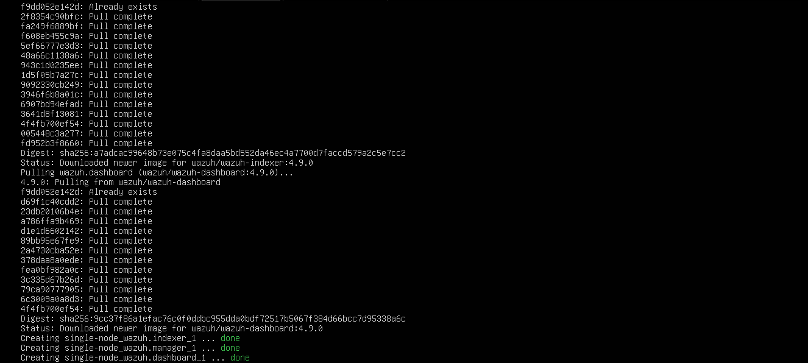
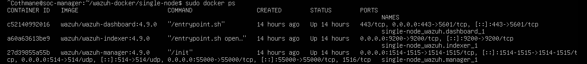
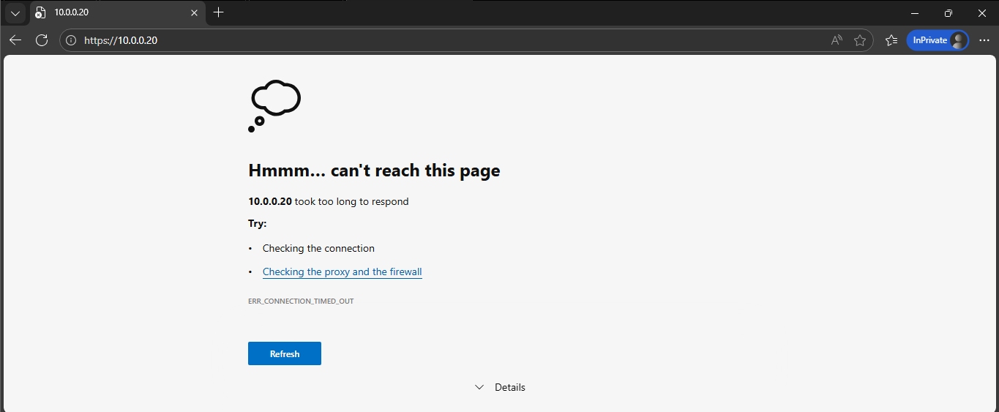
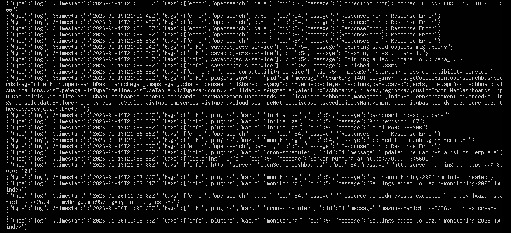

##  SOC Manager & Wazuh Deployment

In this stage, I successfully deployed the central monitoring node (SOC Manager) using Docker containers.

###  System Configuration
- **Host:** Ubuntu Server (soc-manager)
- **IP Address:** 10.0.0.20 (Static)
- **Architecture:** Managed via pfSense firewall (10.0.0.1 gateway)

###  Implementation Steps
1. **Network Alignment:** Configured the static IP and DNS to ensure connectivity through the local gateway.
2. **Infrastructure Prep:** Adjusted `vm.max_map_count` and prepared the Docker environment.
3. **Security:** Generated self-signed SSL certificates for secure communication between nodes.
4. **Orchestration:** Deployed the Wazuh stack (Indexer, Server, Dashboard) using `docker-compose`.

###  Verification
All containers are running correctly as shown in the deployment logs:

### Case Study: Troubleshooting Service Availability in Dockerized Wazuh Stack

##  Incident Investigation
While the infrastructure was deployed successfully, a critical gap was identified between the **Container Status** and **Service Availability**. 

### 1. Persistence of Zombie Containers
Despite the backend services being unreachable, Docker reported that the containers had been running for over **14 hours**. This indicates that the processes were alive at the OS level, but the application services (Wazuh Dashboard & Indexer) were stuck in an initialization loop or failing internal health checks.

**Evidence:**
- **Container Uptime:** `Up 14 hours` (Confirmed via `docker ps`).
- **Service Name:** `single-node_wazuh.dashboard_1`.

### 2. Browser Connection Failure
Attempting to access the SOC Web Interface resulted in a persistent loading state followed by a connection timeout.

**Evidence:**
- **URL:** `https://10.0.0.20`
- **Error:** `Hmmm... can't reach this page`.
- **Symptoms:** The browser fails to establish a TCP handshake with Port 443, suggesting the Dashboard service is not binding correctly to the host network.

###  3. Root Cause (from Logs)
Executing `sudo docker logs -f single-node_wazuh.dashboard_1` revealed the following critical error:
> `Error: [ConnectPD]: Connection refused at 172.18.0.2:9200`

**Root Cause Analysis (RCA):**
- The Dashboard is trying to communicate with the Indexer on IP `172.18.0.2`.
- The Indexer is either not ready, or its security certificates (SSL/TLS) are mismatched, leading to a rejected connection at the API level.

