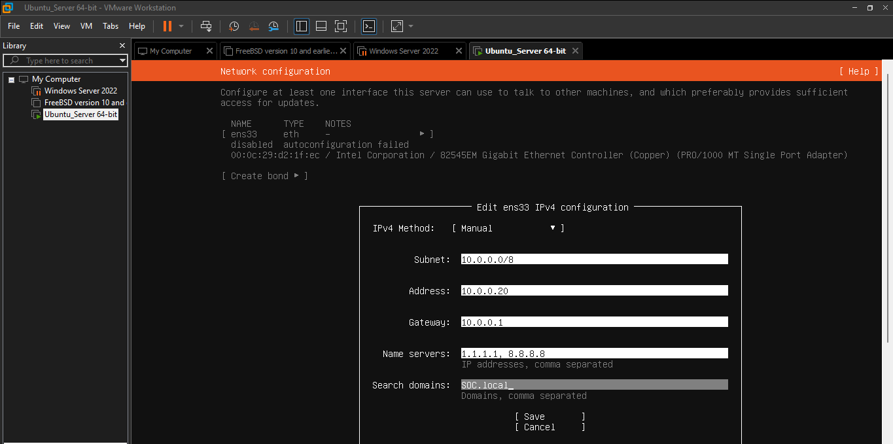

#  SOC Automation & Monitoring Lab - Infrastructure Phase

This repository documents the deployment of a professional Security Operations Center (SOC) home lab. The primary goal is to establish a centralized management server (SOC Manager) to host SIEM and EDR solutions.

##  Phase 1: SOC Manager Deployment (Ubuntu Server)

In this phase, I deployed a dedicated **Ubuntu 24.04 LTS** server. This server acts as the "brain" of the lab, managing logs, alerts, and monitoring agents.

###  Network Topology & Configuration
To ensure a secure environment, the server is positioned behind a **pfSense** firewall within a dedicated LAN segment. 

**Network Parameters:**
* **Hostname:** `soc-manager`
* **Static IP Address:** `10.0.0.20`
* **Subnet Mask:** `255.0.0.0` (/8)
* **Default Gateway:** `10.0.0.1` (pfSense LAN Interface)
* **DNS Servers:** `1.1.1.1`, `8.8.8.8`
* **Search Domain:** `SOC.local`

> 

###  Hardware Specifications (VMware)
The virtual machine was configured with optimized resources to handle containerized security tools:
* **CPU:** 2 Cores
* **RAM:** 4 GB
* **Disk:** 50 GB (LVM disabled for better container performance)

> 

###  Docker & Environment Setup
Docker was chosen as the containerization engine to run **Wazuh (SIEM)** and **Zabbix (Monitoring)**. 

#### 1. System Update
First, ensured the system repositories were up to date via the pfSense gateway:
sudo apt update && sudo apt upgrade -y

#### 2. Docker Installation
Installed the Docker engine and Docker Compose:
sudo apt install docker.io docker-compose -y

#### 3. Service Configuration
Enabled the Docker service to start automatically on system boot:
sudo systemctl enable --now docker

#### 4. Post-Installation Verification
Verified the installation and internet reachability:

Internet Check: ping -c 4 google.com (Successful)

Docker Check: docker --version (Successful)

SSH Status: Enabled OpenSSH server for remote management

## Wazuh SIEM/XDR Installation

The Wazuh security stack has been successfully orchestrated using Docker Compose. All core components are operational and secured with generated SSL certificates.

### Components Status:
* **Wazuh Manager:** Centralized engine for log analysis and alert generation.
* **Wazuh Indexer:** High-performance search and analytics engine.
* **Wazuh Dashboard:** Web-based UI for visualization and management.

### Access and Verification:
1. **Internal IP:** `https://10.0.0.20` (Configured behind pfSense Gateway).
2. **Container Health:** Verified that all services reached the `done` state during creation.
