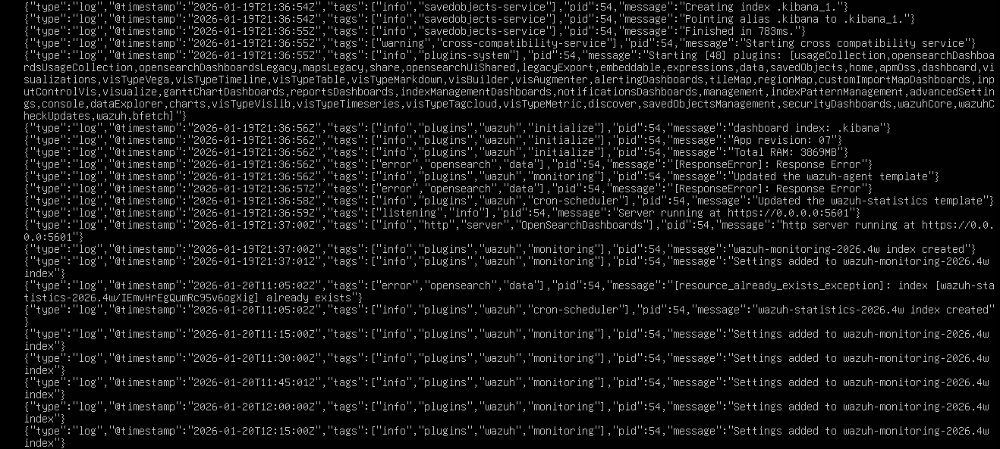
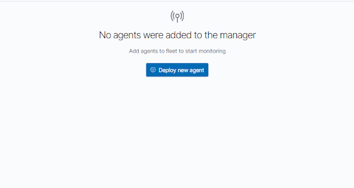

##  SOC Manager & Wazuh Deployment

In this stage, I successfully deployed the central monitoring node (SOC Manager) using Docker containers.

###  System Configuration
- **Host:** Ubuntu Server (soc-manager)
- **IP Address:** 10.0.0.20 (Static)
- **Architecture:** Managed via pfSense firewall (10.0.0.1 gateway)

###  Implementation Steps
1. **Network Alignment:** Configured the static IP and DNS to ensure connectivity through the local gateway.
2. **Infrastructure Prep:** Adjusted `vm.max_map_count` and prepared the Docker environment.
3. **Security:** Generated self-signed SSL certificates for secure communication between nodes.
4. **Orchestration:** Deployed the Wazuh stack (Indexer, Server, Dashboard) using `docker-compose`.

###  Verification
All containers are running correctly as shown in the deployment logs:

### Case Study: Troubleshooting Service Availability in Dockerized Wazuh Stack

##  Incident Investigation
While the infrastructure was deployed successfully, a critical gap was identified between the **Container Status** and **Service Availability**. 

### 1. Persistence of Zombie Containers
Despite the backend services being unreachable, Docker reported that the containers had been running for over **14 hours**. This indicates that the processes were alive at the OS level, but the application services (Wazuh Dashboard & Indexer) were stuck in an initialization loop or failing internal health checks.

**Evidence:**
- **Container Uptime:** `Up 14 hours` (Confirmed via `docker ps`).
- **Service Name:** `single-node_wazuh.dashboard_1`.

### 2. Browser Connection Failure
Attempting to access the SOC Web Interface resulted in a persistent loading state followed by a connection timeout.

**Evidence:**
- **URL:** `https://10.0.0.20`
- **Error:** `Hmmm... can't reach this page`.
- **Symptoms:** The browser fails to establish a TCP handshake with Port 443, suggesting the Dashboard service is not binding correctly to the host network.

###  3. Root Cause (from Logs)

### 1. Backend Connectivity Failure (Indexer Unreachable)
* **Error:** `[ConnectionError]: connect ECONNREFUSED 172.18.0.2:9200`.
* **Impact:** The Dashboard cannot establish a socket connection with the Indexer API. This is the primary reason the web interface fails to load.

### 2. Critical Resource Constraint (Low RAM)

* **Detection:** System logs identify total available memory as `3869MB` (~4GB).
* **Impact:** The Wazuh Indexer and Manager require significant heap memory to start. Operating the full stack on 4GB causes services to stall or refuse connections due to resource exhaustion.

### 3. Service State Deadlock (Index Conflict)
* **Error:** `[resource_already_exists_exception]: index [wazuh-statistics-...] already exists`.
* **Impact:** Because containers remained in a failed state for 14 hours, the Indexer is stuck attempting to recreate existing indices, preventing the security handshake from completing.

### 4. Administrative Command Failure (Naming Mismatch)
* **Detection:** Attempts to run `docker exec` or `docker logs` failed with `No such container`.
* **Impact:** Commands were issued using shorthand names (e.g., `wazuh.dashboard`) instead of the actual container names defined by the compose project (`single-node_wazuh.dashboard_1`).
  
##  Evidence Log
| Component | Status | Log Evidence |
| :--- | :--- | :--- |
| **Network** | Timeout | `10.0.0.20 took too long to respond` |
| **Memory** | Insufficient | `Total RAM: 3869MB` |
| **API** | Refused | `connect ECONNREFUSED 172.18.0.2:9200` |
| **Storage** | Conflict | `resource_already_exists_exception` |

### Executed Remediation Steps

### Phase 1: Infrastructure Optimization: Vertical Scaling
- **Initial State**: System detected only `3869MB` of RAM, causing JVM heap errors in Wazuh Indexer.
- **Action**: Shutdown VM and reallocated physical memory from 4GB to **8GB**.

### Phase 2: Environment Reset
* **Action**: Stopped and removed all active containers and the virtual network bridge.
* **Command**: `sudo docker-compose down`.
* **Outcome**: Successfully cleared "zombie" processes that had been running for over 14 hours.

### Phase 3: Sequential Service Bootstrapping
* **Action**: Initiated a staged startup by launching the **Wazuh Indexer** as a standalone service.
* **Verification**: Confirmed the Indexer container (`single-node_wazuh.indexer_1`) is running and has successfully bound to port `9200/tcp`.
* **Current Uptime**: The Indexer has been stable for **20 minutes**, ensuring the API is ready for Dashboard connection.

### Phase 4: Deploy the remaining Wazuh Stack
Deploy the remaining Wazuh Stack (Manager and Dashboard) now that the backend service is healthy.
* **Command**: `sudo docker-compose up -d`.

### Phase 5: Successful Recovery & Service Validation
The Wazuh login interface at `https://10.0.0.20/app/login` is now fully operational. This confirms that:
- The **Wazuh Dashboard** has successfully established a connection with the **Indexer** on `172.18.0.2:9200`.
- The `ECONNREFUSED` error has been fully resolved.
- The system is now ready for the **Attack Simulation** phase.

### Phase 6: Operational Dashboard & Alert Validation
The Wazuh Dashboard is now fully operational and receiving security events.
- **Service Status**: Active and processing telemetry.
- **Initial Baseline**: Recorded **46 Medium severity** and **146 Low severity** alerts during the first minutes of operation.
- **Verification**: Confirmed that the Manager and Indexer are successfully synchronized.

###  Conclusion & Lessons Learned
- **Resource Monitoring**: High container uptime (14h+) is not a valid indicator of service health; monitoring application logs (`docker logs`) is essential.
- **Dependency Management**: In complex stacks like Wazuh, sequential booting (starting the Indexer before the Dashboard) prevents API handshake failures.

##  Phase 7: Post-Deployment Sync & Heartbeat Verification

While the administrative shell confirms the service is running, the Dashboard reflects a "Zero Agent" state, indicating a propagation delay.

###  Technical Diagnosis:
- **Registration Latency**: The `wazuh.manager` container may take up to 60 seconds to process the initial enrollment request from the `Amine` agent.
- **L7 Handshake**: The agent must successfully exchange a unique key over Port 1515 before it appears in the `Endpoints Summary`.
- **UI Cache**: The browser session might require a manual refresh to pull the latest agent table from the Indexer.

###  Immediate Action:
Perform a manual refresh of the Dashboard page after 60 seconds of service uptime.

#  Achievement Report: System Resource Management & Wazuh SIEM Optimization

## 1. Problem Statement
The cybersecurity lab environment experienced a total service outage due to critical storage depletion:
* **Service Disruption**: The Wazuh Dashboard became inaccessible, throwing an `Empty reply from server` error.
* **Host Storage Exhaustion**: The primary system drive (C: SSD) dropped to only **11.9 GB** of free space.
* **VM Bloat**: Virtual Machines were consuming a total of **93.6 GB**, significantly impacting the host operating system's stability.

## 2. Diagnostics Phase
Advanced analytical tools were deployed to identify the primary "space consumers":
* **`ncdu` Utility**: Revealed that the `/var/lib/docker` directory inside the Ubuntu VM was consuming **16.1 GiB**, primarily due to unmanaged indexing and log volumes.
* **WizTree Analysis**: Discovered that the Ubuntu physical disk file occupied **44.8 GB** on the SSD, which significantly exceeded its actual internal data usage.
* **`htop` Monitoring**: Confirmed that RAM usage was stable at **2.17 GB** out of 7.71 GB, confirming the bottleneck was strictly storage-related.

## 3. Implementation Strategy (The Solution)
A multi-tier strategic plan was executed to restore system balance and reclaim premium SSD space:

### A. Internal Environment Cleanup (Ubuntu)
* Purged corrupted Wazuh indices and unnecessary Swap files, successfully recovering **28 GB** of internal free space.
* Executed the **Compact** utility within VMware settings to shrink the physical `.vmdk` file from **36.8 GB** to match its actual data footprint.

### B. Physical Infrastructure Migration
* Migrated "heavy" systems—Windows 10 (27.5 GB) and Windows Server (18.2 GB)—from the saturated SSD (C:) to the high-capacity HDD (D:).
* Utilized **Cut/Paste** operations instead of standard Copying to avoid "insufficient space" errors during the transfer process.

### C. Permissions & Access Resolution
* Resolved the `Insufficient permission` error in the new path by granting **Full Control** permissions to the `Everyone` group on the migrated VM folders.
* Bypassed "Lock File" (`.lck`) conflicts by launching VMware Workstation with **Administrative Privileges**.

## 4. Final Results (Key Achievements)
| Metric | Pre-Optimization | Post-Optimization |
| :--- | :--- | :--- |
| **C: Drive (SSD) Free Space** | **11.9 GB** (Critical) | **~57 GB** (Healthy) |
| **Wazuh Dashboard Status** | Unresponsive (Down) | Fully Operational (Active) |
| **Data Distribution** | Congested on a single SSD | Balanced between SSD and HDD |

## 5. Preventive Recommendations
1. **Log Rotation**: Docker logging has been capped at **100 MB** (`max-size: "100m"`) to prevent future storage spikes.
2. **Tiered Storage Policy**: Maintain the Wazuh Indexer on the SSD for high I/O performance, while keeping "Victim" agents (Windows VMs) on the HDD to conserve premium host space.
