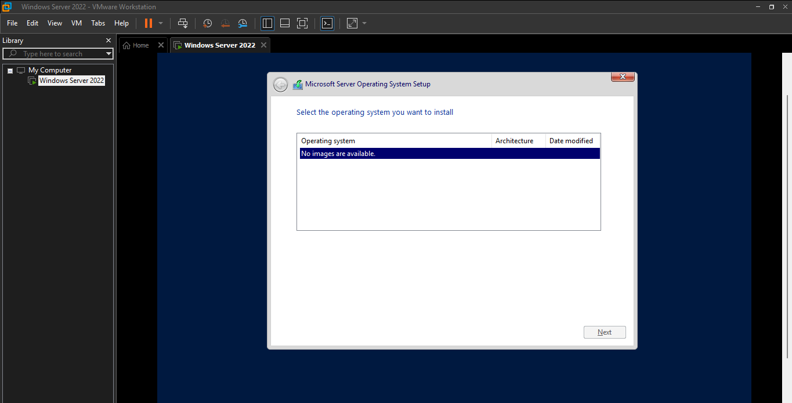

# Project 1: Windows Server & Active Directory Deployment

##  Overview
This project involves the end-to-end installation and configuration of **Windows Server 2022 Data Center** to serve as the primary Domain Controller (DC-022) for a secure hybrid enterprise environment.

##  System Specifications & Resources
| Feature | Details |
| :--- | :--- |
| **Operating System** | Windows Server 2022 Data Center |
| **Hostname** | DC-022 |
| **RAM** | 2 GB (Optimized for 20 users) |
| **CPU** | 2 Cores |
| **Storage** | 40 GB SATA |

---

##  Phase 1: Installation & Troubleshooting
During the initial setup in VMware Workstation, a critical issue was encountered that prevented the OS installation.

###  The Problem: "No Images Available"
Upon reaching the operating system selection screen, the installer displayed an error: **"No images are available"**. This was likely due to a conflict with the virtual hard disk controller type or the initial disk configuration.

> **Visual Evidence of Error:**
> 

###  The Solution: Disk Reconfiguration
To resolve this, I performed the following troubleshooting steps:
1. **Hard Disk Removal:** Deleted the existing virtual hard disk from the VM settings.
2. **Floppy Removal:** Removed the virtual Floppy drive and the associated autoinst.flp file from the VM settings.
3. **New Disk Creation:** Added a new Hard Disk via the **Add Hardware Wizard**.
4. **Controller Type:** Specifically selected **SATA** to ensure compatibility.
5. **Capacity & Allocation:** Set a **40 GB** maximum disk size and chose to **split the virtual disk into multiple files** for better performance and portability.

> **Troubleshooting Steps Captured:**
> 
> 
> 
> 
> 

###  Result
After reconfiguring the disk hardware, the installer successfully identified the drive, allowing the installation to proceed.

---

##  Phase 2: Network & DNS Configuration
[cite_start]After a successful OS installation, the server was hardened with a static network identity to support **Active Directory Domain Services (AD DS)** and **DNS**.

### IP Addressing Plan:
- **Static IP:** `10.0.0.10`
- **Subnet Mask:** `255.0.0.0`
- **Default Gateway:** `10.0.0.1`
- **Preferred DNS:** `10.0.0.10` (Self-referencing for AD roles)

> **Network Configuration Screenshot:**
> 

---

## 🎯 Current Status & Next Steps
- [x] [cite_start]OS Installation & Troubleshooting.
- [x] Static IP & Hostname (DC-022) Configuration.
- [ ] Active Directory Domain Services (AD DS) Role Installation.
- [ ] [cite_start]Organizational Unit (OU) & Group Policy (GPO) implementation.
