### Configuring the static network parameters on the Windows Client

Before that, you need to verifying that:
* **Network Binding**: Attached to **LAN Segment: Corporate**.
> 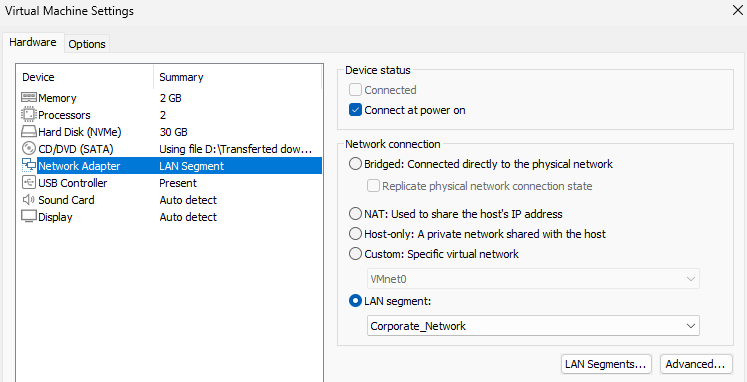

Then, you should follow these steps, to configuring the static network parameters on the Windows Client:

> 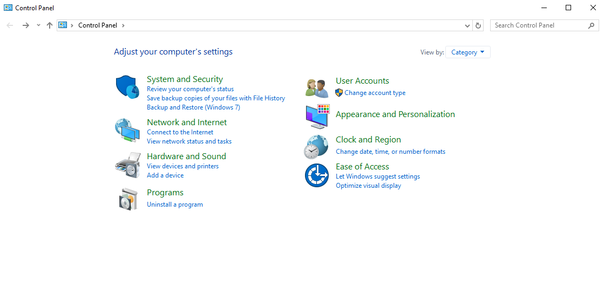
> 
> 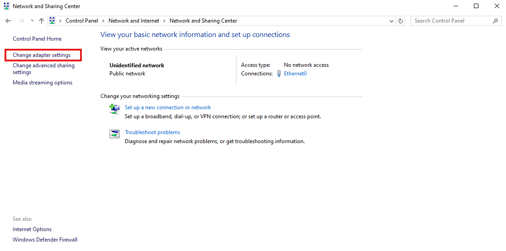
> 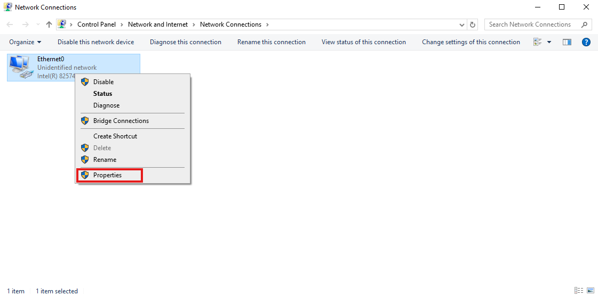
> 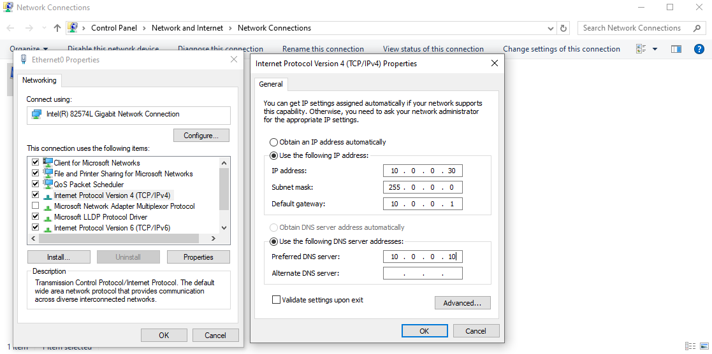

### Client-to-Server Connectivity Validation

After configuring the static network parameters on the Windows Client, a verification phase was initiated to ensure seamless communication within the **Corporate Network** LAN segment.
> 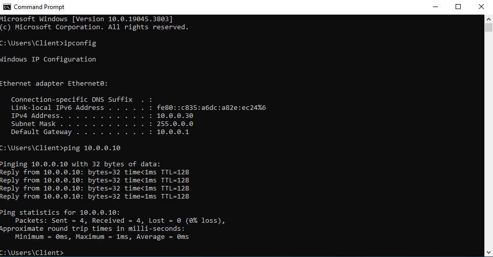

### 1. Network Configuration Audit
The client workstation was successfully provisioned with a dedicated static IP to ensure persistent identity:
- **Hostname**: `Client`
- **IPv4 Address**: `10.0.0.30`
- **Subnet Mask**: `255.0.0.0` (Synchronized with AD Machine)
- **Default Gateway**: `10.0.0.1`

### 2. Connectivity Benchmarking (Ping Test)
To verify the Layer 3 reachability between the Client and the Domain Controller (`10.0.0.10`), an ICMP echo request was performed:
- **Target**: `10.0.0.10` (DC-022)
- **Packets**: Sent = 4, Received = 4, Lost = 0 (**0% loss**).
- **Latency**: Average = **0ms** (Sub-millisecond response time).

### 3. Strategic Outcome
The zero-latency connection confirms that the **LAN Segment** is correctly isolated and operational. This establish the fundamental "pipe" required for:
1. Joining the `SOC.local` Active Directory Domain.
2. Routing security telemetry to the Wazuh Manager at `10.0.0.20`.

##  Phase 2: Active Directory Domain Integration

The integration phase has been successfully completed, marking a critical milestone in the SOC environment setup.

You should firstly to:
> 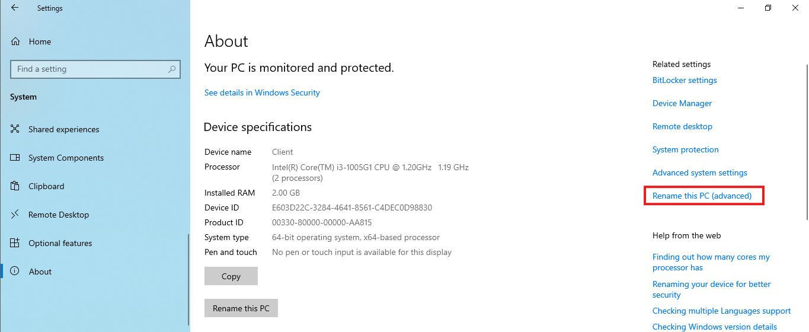
> 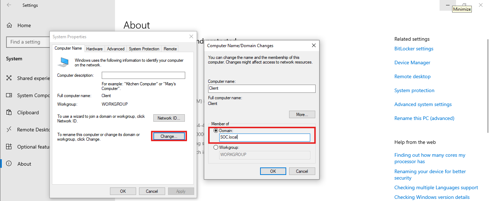

### 1. Verification of Domain Join
- **Confirmation Message**: Received the "Welcome to the SOC.local domain" notification.
- **Authentication Method**: Validated using the verified `SOC\Administrator` credential format.
- **Status**: The workstation `Client` has transitioned from a standalone Workgroup to a managed asset within the `SOC.local` forest.

> 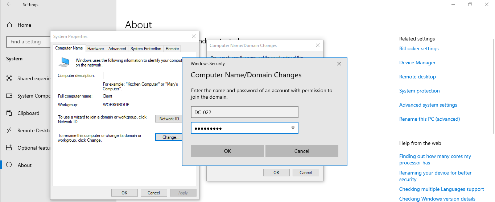
> 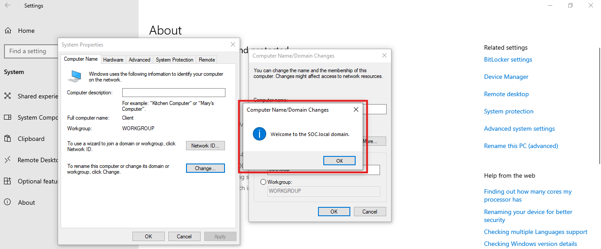

### 2. Post-Join System State
- **Reboot Required**: The system initiated a mandatory restart to apply domain security policies and initialize the computer account object.
- **Network Identity**: The machine is now resolvable as `Client.SOC.local` within the corporate DNS infrastructure.

### 3. Impact on SOC Operations
With the domain join finalized, the lab is now ready for:
* **Centralized Policy Enforcement**: Pushing security configurations via GPOs.
* **Unified Telemetry**: Preparing for the Wazuh Agent deployment to monitor domain-authenticated activities.

##  Phase 3: Asset Transfer and Agent Installation

The **Wazuh Agent** was successfully moved from the centralized repository to the target endpoint for active monitoring.

###  Execution Steps:
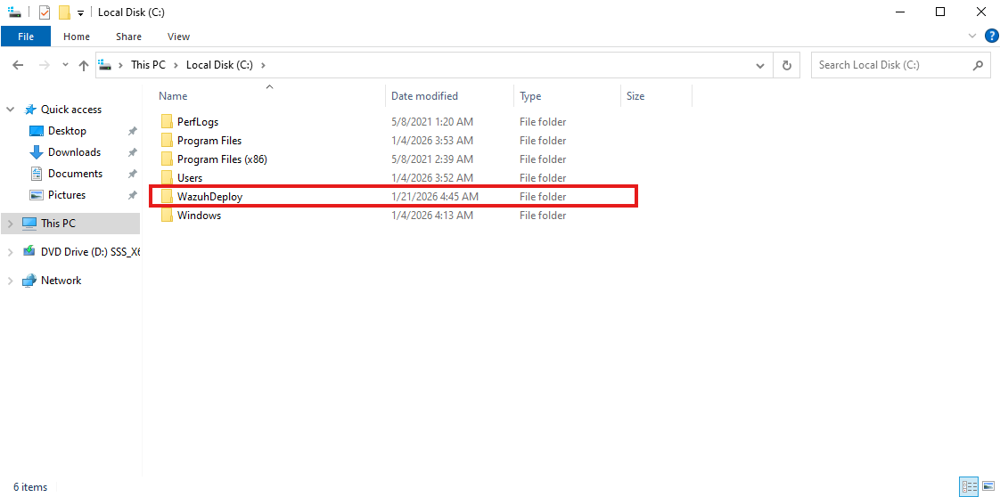
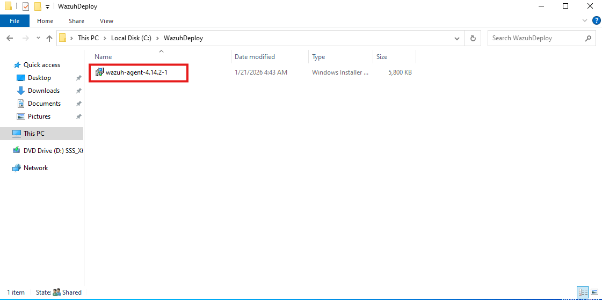
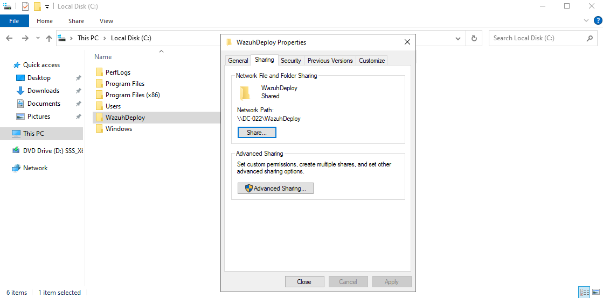
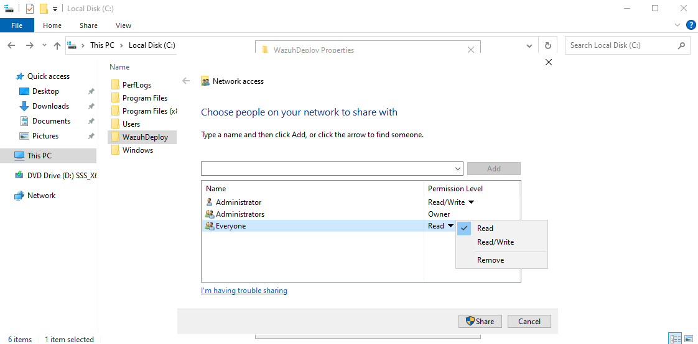

1. **Network Transfer**: Utilized an SMB share on **DC-022** (`\\10.0.0.10\WazuhDeploy`) to deliver the installer to the domain-joined client.
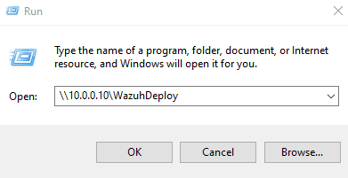
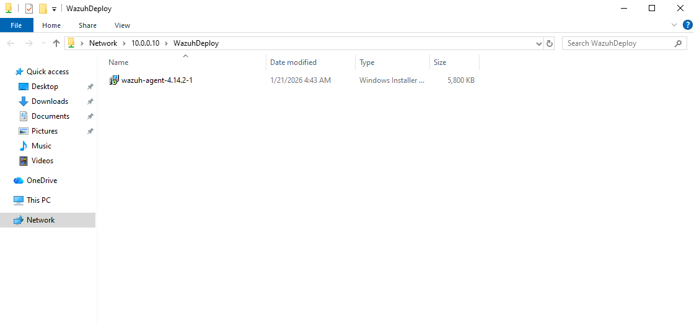
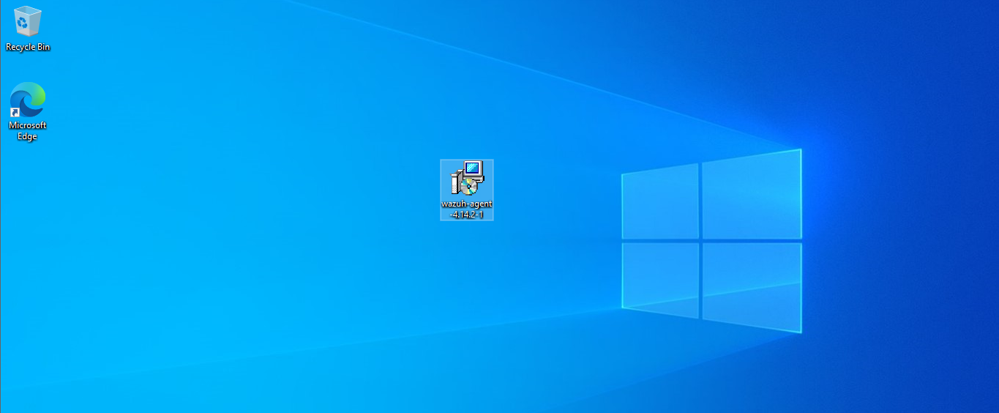

3. **Command-Line Deployment**: Executed a silent installation using `msiexec` on the **Client**, explicitly pointing to the **Wazuh Manager** at `10.0.0.20`.
## Correcting Command Syntax and Execution Path

The installation failure was traced to a command concatenation error in the CLI environment.
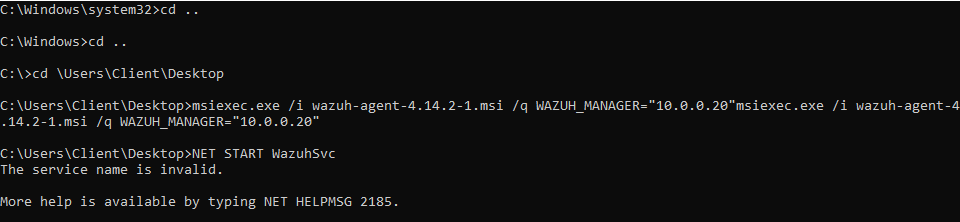

###  Technical Root Cause:
- **Redundant Strings**: The `msiexec.exe` command was inadvertently doubled within a single execution string, causing the installer to trigger the help dialogue instead of the installation process.
- **Directory Verification**: The working directory was correctly changed to `C:\Users\Client\Desktop` to ensure the `.msi` package was accessible to the installer.

###  Resolution:
- Re-executed the installation command using a single, cleaned syntax string.
- Manually verified service registration via `NET START WazuhSvc` following the command execution.
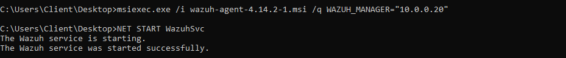

5. **Service Initialization**: Confirmed the `Wazuh` service status as running, enabling real-time telemetry shipping to the SOC dashboard.
